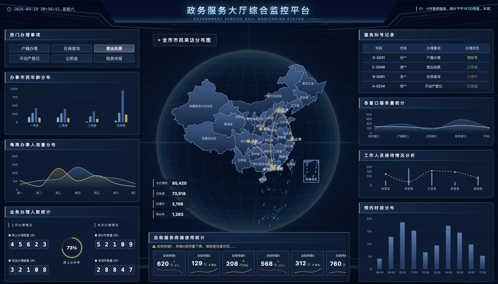

# 政务服务大厅综合监控平台

一个基于 React、TypeScript 和 Vite 构建的政务风格大屏可视化项目，适用于政务服务大厅、综合业务大厅、自助终端运营监控等场景展示。

项目当前以内置 Mock 数据驱动，围绕“来访分布、业务统计、窗口服务、终端使用、预约情况”等核心信息构建三栏式可视化界面，适合用于前端原型展示、课程作业、方案演示和可视化项目练习。

## 项目预览



当前界面采用典型政务大屏布局：

- 顶部：平台标题、实时时间、公告跑马灯
- 左侧：热门办理事项、年龄分布、周人流趋势、业务办理统计
- 中部：全国来访分布图、今日预约 KPI、自助终端使用统计
- 右侧：服务叫号记录、窗口服务量、工作人员接待分析、预约时段分布

整体视觉以深蓝底色、官蓝主色和金色点缀为主，更贴近政务大厅和指挥中心类展示风格。

## 技术栈

- React 19
- TypeScript
- Vite
- Tailwind CSS 4
- Recharts
- ECharts + `echarts-for-react`
- `autofit.js`
- `date-fns`
- `lucide-react`

## 功能特性

- 基于 1920 × 1080 大屏设计稿进行适配，支持窗口缩放自动等比缩放
- 使用 Recharts 与 ECharts 混合构建图表与地图模块
- 支持地图流向线、城市散点、趋势图、柱状图、组合图等可视化内容
- 提供数字递增、列表轮播、高亮轮播、图表波动刷新等动态效果
- 顶部时间实时刷新，公告内容支持跑马灯展示
- 通过 Mock API 模拟异步请求，便于后续替换为真实接口
- 启用了 `vite-plugin-singlefile`，适合导出为单文件静态展示版本

## 快速开始

### 安装依赖

```bash
npm install
```

### 启动开发环境

```bash
npm run dev
```

### 构建生产版本

```bash
npm run build
```

### 本地预览构建结果

```bash
npm run preview
```

## 项目结构

```text
.
├── src
│   ├── api
│   │   ├── index.ts              # API 封装，当前为 Mock 异步请求
│   │   └── mock/data.ts          # 演示数据
│   ├── assets                    # 背景图等静态资源
│   ├── components
│   │   ├── Header.tsx            # 顶部状态栏
│   │   ├── LeftPanel.tsx         # 左侧图表与统计模块
│   │   ├── CenterPanel.tsx       # 中部地图与终端统计
│   │   ├── RightPanel.tsx        # 右侧记录与分析模块
│   │   └── Card.tsx              # 通用卡片组件
│   ├── hooks
│   │   ├── useData.ts            # 数据请求 Hooks
│   │   └── useCarousel.ts        # 动画与轮播效果 Hooks
│   ├── App.tsx                   # 页面整体布局入口
│   ├── main.tsx                  # 应用入口
│   └── index.css                 # 全局样式与主题变量
├── screenshot                    # README 预览截图
├── index.html
├── vite.config.ts
├── package.json
└── README.md
```

## 数据说明

当前项目尚未接入真实后端接口，数据主要来自：

- `src/api/mock/data.ts`

整体数据流如下：

- `src/api/mock/data.ts`：维护演示数据
- `src/api/index.ts`：封装为带延迟的模拟异步请求
- `src/hooks/useData.ts`：统一向页面组件提供数据读取 Hook

这样处理的好处是：

- 开发和演示阶段不依赖真实后端
- 页面结构已经具备异步加载模型
- 后续替换接口时改动集中在 `api` 层

## 地图说明

中间地图模块会在运行时加载中国 GeoJSON：

- `https://geo.datav.aliyun.com/areas_v3/bound/100000_full.json`

随后通过 ECharts 注册地图并渲染流向线和城市散点。

如果部署环境无法访问该地址，可以将 GeoJSON 改为本地静态资源、内部服务地址或自有 CDN 地址。

## 适用场景

- 政务服务大厅监控大屏
- 智慧园区 / 智慧城市可视化驾驶舱原型
- 业务运营态势展示页
- 数据可视化练习、课程项目、毕设演示

## 后续可扩展方向

- 接入真实业务接口
- 增加区域筛选、时间筛选和图表联动
- 接入 WebSocket / SSE 实时数据推送
- 支持地图钻取和区域级联展示
- 抽离图表配置 schema，提升模块复用性
- 增加多套行业主题或深浅主题切换

## 说明

- 当前仓库偏展示型前端原型，重点在视觉呈现与信息编排
- 如果用于生产环境，建议补充权限鉴权、错误兜底、加载态、监控埋点和测试用例
